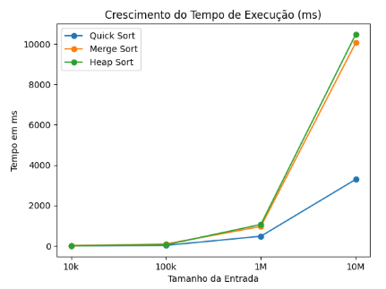

# 📊 Algoritmos de Ordenação: Performance e Comparação


### 🛠️ Tecnologias e Ferramentas
<p align="left">
  
  
  
  
</p>

### 📈 Estatísticas do Repositório
<p align="left">
  
  
  
</p>

---

Este projeto consiste em uma implementação em **C++** para comparar a eficiência de três dos algoritmos de ordenação mais conhecidos: **Heap Sort**, **Merge Sort** e **Quick Sort**. O programa utiliza a biblioteca `<chrono>` para medir o tempo de execução com precisão de milissegundos.

## 🚀 Algoritmos Implementados

O código utiliza uma estrutura customizada que herda de `std::vector<int>`, encapsulando as lógicas de:

* **Quick Sort:** Utiliza a estratégia de dividir para conquistar com um pivô central.
* **Merge Sort:** Divide o array recursivamente e mescla as partes ordenadas (implementação utilizando sub-vetores).
* **Heap Sort:** Transforma o vetor em uma estrutura de dados de árvore (heap) para extrair os elementos em ordem.

---

## 📊 Resultados de Benchmark

Com base nos testes realizados, foram observados os seguintes tempos de resposta de acordo com o tamanho do vetor (N):

### Com N = 10.000 posições
| Algoritmo | Tempo (ms) |
| :--- | :--- |
| **Quick Sort** | 2.1582 ms |
| **Heap Sort** | 4.1902 ms |
| **Merge Sort** | 7.4876 ms |

### Com N = 1.000.000 posições
| Algoritmo | Tempo (ms) |
| :--- | :--- |
| **Quick Sort** | 289.323 ms |
| **Heap Sort** | 630.461 ms |
| **Merge Sort** | 962.198 ms |



> **Nota:** O Merge Sort apresentou o início da contagem de tempo (acima de 0ms) mais cedo que os demais (a partir de 1.000 posições), indicando um custo maior de alocação de memória na sua implementação recursiva com vetores.

---

## 🛠️ Tecnologias Utilizadas

* **Linguagem:** C++11 ou superior.
* **Bibliotecas Padrão:**
    * `<chrono>`: Para medição de tempo de alta resolução.
    * `<random>`: Para geração de números aleatórios de forma uniforme.
    * `<vector>`: Para gerenciamento dinâmico do array.

## ⚙️ Como Executar

1. Certifique-se de ter um compilador C++ instalado (como o `g++`).
2. Compile o arquivo:
   ```bash
   g++ -o comparador_sort nome_do_seu_arquivo.cpp
